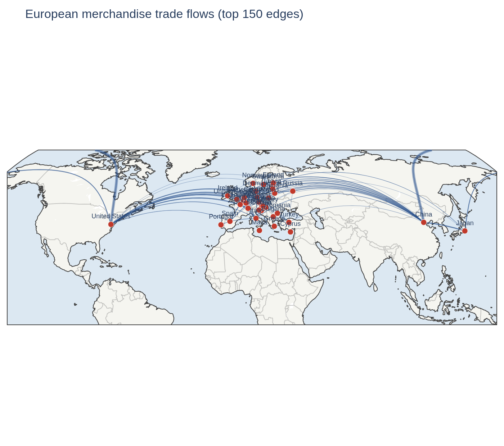

# European Trade Network

> Complex-systems analysis of European merchandise trade — **centrality**, **trade
> communities**, and **network resilience** — built from CEPII BACI open data.



**[→ Read the full report](index.qmd)** — RQ sections, figures, and an interactive
community network. Render it locally with `quarto render` (output in `_site/`).

## The question

Which economies hold the European trade network together, do coherent trade blocs
emerge from the flow structure, and how much of Europe's trade survives the loss of its
biggest hubs? This project models **countries as nodes** and **directed, weighted trade
flows as edges**, then applies network science to answer three questions — with Austria
as a running reference point.

## Research questions & key findings

**RQ1 — Who is central, and where does Austria rank?**
Germany holds the network together: weighted betweenness **0.829**, more than 4× China's
**0.191**, despite China exporting *more* (1,654 bn vs 1,354 bn USD) — China is a source,
Germany is a hub. Only **15 of 35** economies have positive betweenness at all, because the
graph is complete (density = 1) and most pairs already trade directly. Austria is **not** a
bridge: **betweenness = 0**, 17th of 35 by export strength (182 bn USD) and 13th by PageRank,
with Germany its largest partner both ways. The disparity filter keeps **184 of 1,190 edges**
at α = 0.05 ([`02_backbone_map.png`](figures/headline/02_backbone_map.png)).

**RQ2 — Do trade communities emerge, and do they follow geography?**
Weighted Louvain on the disparity-filter backbone finds **3 communities (modularity Q = 0.25)**:
a German-anchored continental core, a Nordic-Baltic cluster (Norway, Sweden, Denmark, Finland,
Estonia), and an extra-European partner bloc (USA, China, Japan, Russia, UK, Turkey). The blocs
follow **geography and trade intensity, not EU membership** — the EU-27 splits across all three,
non-members Switzerland and Norway sit inside their neighbouring EU clusters, and EU-member
Ireland joins the US-led bloc (its exports are dominated by US-linked pharma/tech).

**RQ3 — How resilient is the network to hub failure?**
Connectivity is not the weak point: the full graph is complete (density = 1) and never
fragments. On the significant-trade backbone it does — targeted removal by betweenness
breaks it after **34% of economies (12 of 35)**, by export strength after **40% (14)**,
versus **89% (31)** under random failure, so the network is ≈2.6× more tolerant of accidents
than of a deliberate hit list. **Value is far more fragile than topology**: losing just
**three economies (China, Germany, the USA — 9% of nodes) halves total trade value**, while
random failure needs ten (29%). Germany alone carries 27% of the network's trade value.

**RQ4 — Energy trade (HS-27) vs total trade**
Energy is **12% of the network's value** but a structurally different market: the **top 3
exporters carry 55% of energy exports (Russia, Norway, the USA) against 38% for merchandise
overall** (China, Germany, the USA) — a Herfindahl index of 0.124 vs 0.075, i.e. **8 effective
suppliers instead of 13**. The manufacturing hubs that dominate merchandise trade cannot sell
resources they do not have, so resource exporters take their place. Austria is **12th of 35 by
energy exports** and a net importer; its energy exports are re-exports and transit (53%
electricity, 26% gas) and 59% of its energy imports arrive via Germany. Two caveats are part of
the finding: only **48% of these economies' energy imports originate inside the node set**
(65% for merchandise), and pipeline gas is misattributed by customs data — so this is a map of
how energy is *redistributed* within Europe, not of where it comes from. Electricity (HS-2716)
is the bridge to the sibling project
[austria-energy-analysis](https://github.com/fatemeh-studio/austria-energy-analysis), which
measures the same Austrian flows hourly from ENTSO-E.

## Data

**CEPII BACI** — harmonised bilateral trade flows at HS-6 product level, 200+ countries.
Distributed under the Etalab Open Licence 2.0. Raw files are **not committed** (they are
large and versioned); see [`data/README.md`](data/README.md) for the one-time download
step. Scope: EU-27 plus 8 major partners (GBR, CHE, NOR, USA, CHN, TUR, RUS, JPN) =
**35 economies**, **1,190** directed edges, **9,755 bn USD** of trade in **2022** — the
year and country set are configurable in `src/eu_trade_network/config.py`.

Source: Gaulier, G. & Zignago, S. (2010), *BACI: International Trade Database at the
Product-Level*, CEPII Working Paper N°2010-23.

## Methods

Directed weighted graph in NetworkX; DuckDB for storing node metrics, edges, and
community assignments and for the SQL rankings; **disparity-filter** backbone extraction
for a dense weighted network; **Louvain** community detection; targeted-vs-random
**resilience** simulation. Visuals in Plotly (geographic flow map), PyVis (interactive
network), and Matplotlib (distributions, resilience curves).

## Reproduce

```bash
# 1. Environment
conda env create -f environment.yml
conda activate eu-trade-network
pip install -e .
pre-commit install
# Notebook outputs are kept on disk but stripped from git via a local nbstripout
# filter. .gitattributes names the filter; each clone must configure it once:
nbstripout --install --attributes .gitattributes

# 2. Data — one-time manual download (see data/README.md)
#    place the BACI CSVs into data/raw/

# 3. Run the analysis notebooks in order
jupyter lab   # run notebooks/01 → 05 top-to-bottom

# 4. (optional) Render the report
quarto render
```

## Project structure

```
src/eu_trade_network/   analysis package (data, graph, metrics, communities, resilience, energy, db, viz)
notebooks/              01 construction → 02 centrality+backbone → 03 communities → 04 resilience → 05 energy
sql/                    schema.sql + analytical queries
data/                   raw/ processed/ external/ (gitignored) · reference/ (committed)
figures/headline/       committed figures used in this README
```

## Related project

Sibling to [`austria-energy-analysis`](https://github.com/fatemeh-studio/austria-energy-analysis)
— RQ4 (energy-commodity subnetwork) is a deliberate bridge between the two.

## Licence

Code: MIT (see `LICENSE`). Data: CEPII BACI under Etalab Open Licence 2.0 — attribution required.
